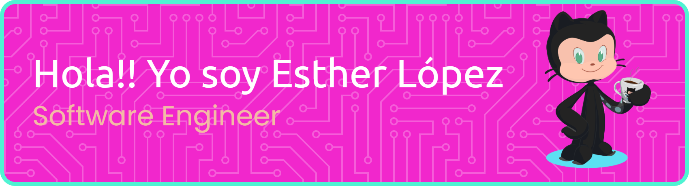

# 🚀 **Desarrolladora apasionada desde España** 💡  

## 🔭 **Actualmente trabajando en:**

Actualmente trabajo como **programadora Full Stack** en **IntecRobots** (Elche, Alicante), desarrollando el software de un **robot recepcionista inteligente** utilizado principalmente en clínicas u hoteles. Aquí mi rol y responsabilidades:

- Utilizo tecnologías como **React Native**, **TypeScript**, **Node.js**, **SQL**, **Docker**, **Prisma**, **NestJS**, **kotlin**, **Asana**, **Figma**, **Xcode** y **GitHub**.
- Integración de múltiples funcionalidades en el sistema del robot.
- Desarrollo de API REST y gestión de base de datos con Prisma y SQL.
- Coordinación del equipo de desarrollo y definición de tareas técnicas.
- Gestión cliente y proyectos.
- Implementación de prácticas DevOps con Docker para entornos de desarrollo y producción.
- Optimización de la arquitectura backend y mejoras continuas en la interfaz móvil.

**Empresa:** IntecRobots (Elche, Alicante)  
**Web:** https://www.intecrobots.es  
**Contacto:** esther@intecrobots.es

**Curriculum web:** (https://www.jobfie.es/cv/estherlopezperez1) 

## 🌱 **Aprendiendo y mejorando en:**  
- 🖥 **Desarrollo Full-Stack**  
- 🔗 **Integración de APIs**  
- 🎮 **Mecánicas de videojuegos**  

## 🤝 **Busco ayuda en:**  
- 🧠 **Mejorar la IA en personajes de videojuegos**  
- ⚙️ **Optimizar el rendimiento del backend**  

## 💬 **Pregúntame sobre:**  
💻 **Desarrollo de software, desarrollo web, Java, JavaScript y lógica de videojuegos** 🚀  

## 📚 **Formación:**  
🎓 **Ingeniería Informática (Cursando)**  
💻 **Bootcamp Incibe Ciberseguridad -Red Team )**
🎓 **Técnico Superior en Desarrollo de Aplicaciones Multiplataforma (DAM)**  
🎓 **Técnico Superior en Desarrollo de Aplicaciones Web (DAW)**  
💻 **Bootcamp de Desarrollo Web en Ironhack**  

## 📫 **Contáctame:**  
✉️ **elopezp8@gmail.com**
✉️ **esther@intecrobots.es**

## 📄 **Conoce más sobre mis experiencias:**  
🔗 [**Descubre mis proyectos en desarrollo web, mecánicas de juegos y aplicaciones Full-Stack.**](#)   Working in progess....🚀  

## ⚡ **Fun Fact:**  
🎮 **Una vez recreé Pac-Man… ¡y terminé programando fantasmas rebeldes!** 👻😂  

<h3 align="left">Conecta conmigo en:</h3>

<h3 align="left">Lenguajes y Herramientas:</h3>

                       

